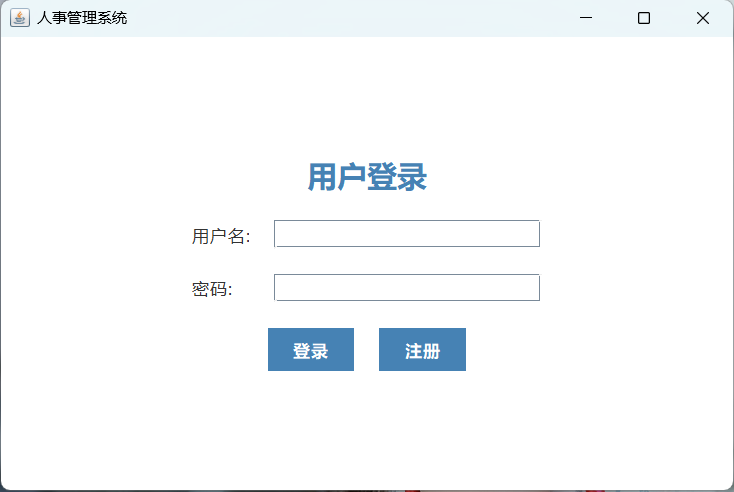
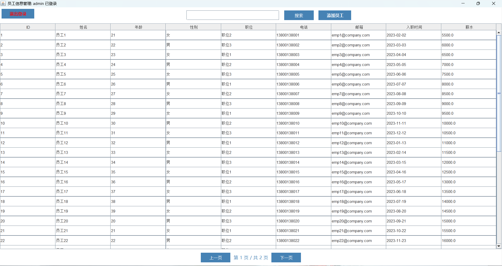
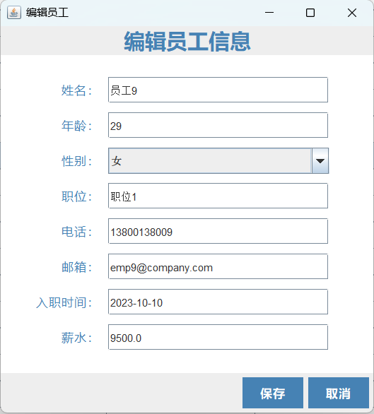
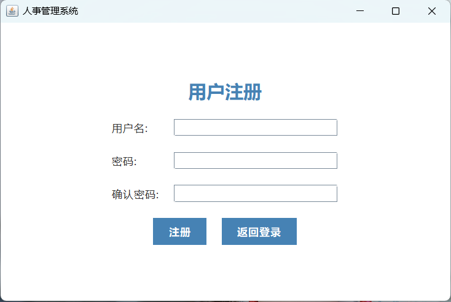

# 🧑‍💼 Java 人事管理系统 (Employee Management System)


基于 Java Swing 的桌面端员工信息管理系统，实现了完整的 CRUD 操作、多条件搜索和分页功能，适合 Java GUI 学习和 MVC 模式实践。

## ✨ 核心功能

- 🔒 **账户系统**：用户注册与登录

- ➕ **员工管理**：添加/编辑/删除员工信息

- 🔍 **智能查询**：支持姓名、电话、职位等多条件搜索

- 📑 **数据分页**：每页 40 条记录的分页浏览

- 👋 **安全退出**：完善的会话管理

## 🛠️ 技术栈

| 类别         | 技术实现                              |
|--------------|---------------------------------------|
| 编程语言     |  |
| GUI框架      |  |
| 数据存储     |  |
| 构建工具     |  |
| 版本控制     |  +  |

## 🏗️ 项目结构

```bash

EmployeeManagerSystem/

├── src/

│   ├── com.hengbai.bean/       # 实体类 (Employee, User)

│   ├── com.hengbai.ui/         # 界面组件 (登录/主界面/编辑窗口)

│   └── com.hengbai.utils/      # 工具类 (输入校验等)

├── docs/                       # 截图文档

├── README.md                   # 项目文档

└── .gitignore                  # 版本控制配置

```

## 🖼️ 系统预览 (示例截图)

| 功能界面       | 描述                     |

|----------------|--------------------------|

| **登录界面**   |  |

| **员工列表**   |  |

| **编辑窗口**   |  |

| **注册页面**   |  |


## 🚀 快速启动

```bash

# 1. 克隆项目

git clone https://github.com/Bai-mu-ha/EmployeeManagerSystem.git

# 2. 使用 IDE (推荐 IntelliJ IDEA) 打开项目

# 3. 运行入口文件:

src/App.java

```

## 🌟 扩展计划

| 功能           | 状态   | 描述                          |

|----------------|--------|-------------------------------|

| 数据持久化     | 🔜     | SQLite/MySQL 数据库支持       |

| 密码加密       | 🔜     | SHA-256/MD5 加密              |

| 多角色权限     | 🔜     | 管理员/普通用户分级权限       |

| Excel 导出     | 🔜     | 员工数据导出为 Excel 文件     |

| 登录审计       | 🔜     | 记录登录时间/IP 等信息        |

| 单元测试       | 🔜     | JUnit 业务逻辑测试            |

## 🤝 参与贡献

1. Fork 项目仓库

2. 创建新分支 (`git checkout -b feature/your-feature`)

3. 提交代码 (`git commit -m 'Add some feature'`)

4. 推送分支 (`git push origin feature/your-feature`)

5. 创建 Pull Request

## 📜 许可证

本项目采用 [MIT License](LICENSE) 开源协议

## 👤 作者

**Hengbai**

[](https://github.com/Bai-mu-ha)

📧 442432818@qq.com

> ⭐ **如果这个项目对您有帮助，欢迎 Star 支持！**
